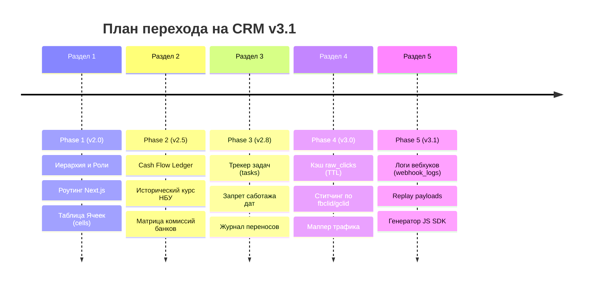

# 🚀 ТЕХНИЧЕСКИЙ РОАДМАП CRM B&W (ВЕРСИЯ 3.1): ИДЕАЛЬНАЯ ПЛАТФОРМА ДЛЯ ХОЛДИНГА

Настоящий документ определяет детальный поэтапный план модернизации и масштабирования CRM-платформы холдинга **B&W** от текущего состояния (v1.2+) до целевой архитектуры **v3.1** на основе требований нового PRD.

---

## 📅 ПОЭТАПНЫЙ ПЛАН РЕАЛИЗАЦИИ (PHASED ROADMAP)



---

### 🛡️ PHASE 1 (v2.0): РЕОГРАНИЗАЦИЯ СТРУКТУРЫ, РОЛЕЙ И ПЕРЕХОД НА ВЛОЖЕННЫЙ РОУТИНГ
**Основная цель:** Уйти от плоской структуры проектов и монолитного интерфейса `LeadsDashboard.tsx` к четкой многоуровневой иерархии холдинга с изоляцией данных и быстрым рендерингом.

#### 1. Расширение схемы БД (DDL)
Для поддержки ячеек и новых ролей необходимо выполнить следующую миграцию в Supabase:

```sql
-- 1. Создание таблицы Ячеек (cells)
CREATE TABLE IF NOT EXISTS public.cells (
    id UUID PRIMARY KEY DEFAULT gen_random_uuid(),
    name VARCHAR(255) NOT NULL,
    cell_leader_id UUID REFERENCES public.profiles(id) ON DELETE SET NULL,
    created_at TIMESTAMP WITH TIME ZONE DEFAULT timezone('utc'::text, now()) NOT NULL
);

-- 2. Связывание проектов с ячейками
ALTER TABLE public.projects 
ADD COLUMN IF NOT EXISTS cell_id UUID REFERENCES public.cells(id) ON DELETE SET NULL;

-- 3. Добавление настроек финансовых моделей в таблицу проектов
ALTER TABLE public.projects 
ADD COLUMN IF NOT EXISTS default_currency VARCHAR(3) DEFAULT 'UAH' CHECK (default_currency IN ('UAH', 'USD', 'EUR')),
ADD COLUMN IF NOT EXISTS revenue_model VARCHAR(20) DEFAULT '50_50' CHECK (revenue_model IN ('50_50', '70_30', 'FIX')),
ADD COLUMN IF NOT EXISTS expert_share_percent NUMERIC(5,2) DEFAULT 50.00,
ADD COLUMN IF NOT EXISTS fixed_fee_amount NUMERIC(12,2) DEFAULT 0.00;

-- Включение RLS для cells
ALTER TABLE public.cells ENABLE ROW LEVEL SECURITY;

CREATE POLICY "Allow all actions for authenticated" ON public.cells
    FOR ALL TO authenticated USING (true);
```

#### 2. Миграция Ролей Пользователей
Обновление ограничений на роли в таблице `public.profiles`:
* Роль `founder` — заменяет избыточное использование `superman` для фаундеров (полный доступ, глобальный дашборд, Telegram-отчеты).
* Роль `cell_leader` — доступ к агрегированным метрикам ячейки и проектам привязанных продюсеров.
* Роль `expert` — гостевой доступ "только для чтения" к финансовой сводке и калькулятору долей своего проекта.
* Роль `marketer` — доступ к аналитике трафика, UTM-разметке и ручной привязке кампаний.
* Роль `developer` — доступ к панели технической диагностики и логам вебхуков.

#### 3. Переход от табов к вложенному роутингу (Next.js App Router)
Разделение монолитного `LeadsDashboard.tsx` (сократит Interaction to Next Paint (INP) до <50мс и уберет утечки памяти при рендере вкладок):
```text
src/app/admin/(dashboard)/
├── page.tsx                     --> Глобальный редирект на основе роли пользователя
├── founder/
│   └── page.tsx                 --> Уровень 1: Дашборд Фаундеров (Витя, Дима)
├── cell/
│   └── [cellId]/
│       └── page.tsx             --> Уровень 2: Дашборд Ячейки (Cell Leader)
└── project/
    └── [projectId]/
        ├── page.tsx             --> Уровень 3: Дашборд Проекта (Продюсер, Эксперт)
        ├── funnel/
        │   └── [funnelId]/
        │       └── page.tsx     --> Уровень 4: Детальный экран Воронки (Маркетолог)
        └── tasks/
            └── page.tsx         --> Трекер задач продюсера
```

---

### 💵 PHASE 2 (v2.5): КНИГА УЧЕТА CASH FLOW, ИСТОРИЧЕСКИЙ КУРС НБУ И РАСПРЕДЕЛЕНИЕ ДОЛЕЙ
**Основная цель:** Заменить лоскутный учет расходов на рекламу и доходов от WayForPay на единую реляционную финансовую книгу холдинга с автоматической конверсией валют на дату совершения операции.

#### 1. Расширение схемы БД (DDL)
```sql
-- Создание таблицы финансовых транзакций (доходы и расходы)
CREATE TABLE IF NOT EXISTS public.transactions (
    id UUID PRIMARY KEY DEFAULT gen_random_uuid(),
    project_id UUID NOT NULL REFERENCES public.projects(id) ON DELETE CASCADE,
    type VARCHAR(10) NOT NULL CHECK (type IN ('INFLOW', 'OUTFLOW', 'REFUND')),
    category VARCHAR(20) NOT NULL CHECK (category IN ('TRAFFIC', 'TEAM', 'SERVICES', 'HARDWARE', 'PROMO', 'COMMISSION', 'REVENUE')),
    amount_original NUMERIC(15,2) NOT NULL,
    currency_original VARCHAR(3) NOT NULL CHECK (currency_original IN ('UAH', 'USD', 'EUR')),
    amount_system NUMERIC(15,2) NOT NULL, -- Приведенная сумма к валюте проекта
    exchange_rate_nbu NUMERIC(10,4) NOT NULL, -- Курс НБУ на дату транзакции
    transaction_date TIMESTAMP WITH TIME ZONE DEFAULT timezone('utc'::text, now()) NOT NULL,
    source_account VARCHAR(255) NOT NULL, -- Например, "ФОП Иванов", "WayForPay", "Банк рассрочка"
    description TEXT,
    created_at TIMESTAMP WITH TIME ZONE DEFAULT timezone('utc'::text, now()) NOT NULL
);

-- Индексы для оптимизации выборок за периоды
CREATE INDEX IF NOT EXISTS idx_transactions_project_date 
ON public.transactions (project_id, transaction_date, type);
```

#### 2. Интеграция с историческим API НБУ
При фиксации расхода/дохода система на бэкенде обращается к сервису `getExchangeRates(transaction_date)`:
1. Запрашивает исторический курс НБУ для `currency_original` к системной валюте проекта на дату `transaction_date`.
2. Рассчитывает и записывает `amount_system = amount_original * exchange_rate_nbu` (или деление в зависимости от пары).
3. Записывает `exchange_rate_nbu` в строку транзакции для сохранения исторического следа (защита от изменения курсов в будущем).

#### 3. Матрица комиссий рассрочек и чистая прибыль
Для автоматического вычета банковских комиссий из рассрочек создается функция-калькулятор на стороне БД:
```sql
CREATE OR REPLACE FUNCTION public.calculate_net_amount(
    p_amount NUMERIC,
    p_payment_method VARCHAR, -- 'wfp', 'privat_installments_3', 'mono_installments_6', etc.
    p_months INT DEFAULT 0
)
RETURNS NUMERIC AS $$
DECLARE
    v_commission_rate NUMERIC := 0.027; -- Стандартный эквайринг WFP 2.7% по умолчанию
BEGIN
    -- Если это рассрочка, применяем матрицу согласно PRD
    IF p_payment_method LIKE '%installments%' THEN
        IF p_months = 3 THEN v_commission_rate := 0.05;
        ELSIF p_months = 6 THEN v_commission_rate := 0.10;
        ELSIF p_months = 12 THEN v_commission_rate := 0.18;
        ELSE v_commission_rate := 0.10; -- По умолчанию
        END IF;
    END IF;

    RETURN ROUND(p_amount * (1 - v_commission_rate), 2);
END;
$$ LANGUAGE plpgsql IMMUTABLE;
```

#### 4. Калькулятор долей (Expert Payout Models)
Реализация математических моделей из раздела 5.3 PRD на бэкенде:
* **Модель 50/50 от Чистой Прибыли (UAH/USD):**
  $$\text{Net Profit} = \sum \text{Revenue (Net of bank fee)} - (\sum \text{Ad Spend} + \sum \text{Team/Services/Hardware/Promo})$$
  $$\text{Expert Share} = \text{Net Profit} \times 0.50$$
  $$\text{Center Share} = \text{Net Profit} \times 0.50$$
* **Модель 70/30 от Валовой Выручки:**
  $$\text{Expert Share} = \sum \text{Revenue (Net of bank fee)} \times 0.70$$
  $$\text{Center Share} = \sum \text{Revenue (Net of bank fee)} \times 0.30$$
* **Модель Фикс + Процент:**
  $$\text{Expert Share} = (\sum \text{Revenue} - \text{Fixed Fee}) \times (1 - \text{Percent})$$

---

### 📋 PHASE 3 (v2.8): ОПЕРАЦИОННЫЙ ТРЕКЕР ЗАДАЧ И ЖУРНАЛ АНТИ-САБОТАЖА ДАТ
**Основная цель:** Повысить дисциплину выполнения планов и исключить бесконечные переносы дедлайнов продюсерами втайне от руководства.

#### 1. Расширение схемы БД (DDL)
```sql
-- Таблица задач продюсеров
CREATE TABLE IF NOT EXISTS public.tasks (
    id UUID PRIMARY KEY DEFAULT gen_random_uuid(),
    project_id UUID NOT NULL REFERENCES public.projects(id) ON DELETE CASCADE,
    title VARCHAR(255) NOT NULL,
    description TEXT,
    due_date DATE NOT NULL,
    status VARCHAR(20) DEFAULT 'TODO' CHECK (status IN ('TODO', 'IN_PROGRESS', 'DONE')),
    created_at TIMESTAMP WITH TIME ZONE DEFAULT timezone('utc'::text, now()) NOT NULL
);

-- Таблица логов изменения дедлайнов (для контроля фаундеров)
CREATE TABLE IF NOT EXISTS public.task_logs (
    id UUID PRIMARY KEY DEFAULT gen_random_uuid(),
    task_id UUID NOT NULL REFERENCES public.tasks(id) ON DELETE CASCADE,
    changed_by UUID NOT NULL REFERENCES public.profiles(id),
    old_due_date DATE NOT NULL,
    new_due_date DATE NOT NULL,
    postponement_reason TEXT NOT NULL, -- Обязательное поле
    created_at TIMESTAMP WITH TIME ZONE DEFAULT timezone('utc'::text, now()) NOT NULL
);
```

#### 2. Защита от саботажа на уровне API
При обновлении `due_date` в таблице `tasks`, бэкенд-эндпоинт проверяет наличие текстового поля `postponement_reason`.
```typescript
// Пример валидатора Next.js Server Action
export async function updateTaskDeadlineAction(taskId: string, newDate: string, reason: string) {
  const session = await getSession();
  if (!reason || reason.trim().length < 10) {
    return { error: "Вы должны указать подробную причину переноса дедлайна (минимум 10 символов)." };
  }
  
  const { data: oldTask } = await supabaseAdmin.from("tasks").select("due_date").eq("id", taskId).single();
  
  // Запись лога переноса
  await supabaseAdmin.from("task_logs").insert({
    task_id: taskId,
    changed_by: session.user.id,
    old_due_date: oldTask.due_date,
    new_due_date: newDate,
    postponement_reason: reason
  });

  // Обновление даты задачи
  await supabaseAdmin.from("tasks").update({ due_date: newDate }).eq("id", taskId);
  return { success: true };
}
```

---

### 🔍 PHASE 4 (v3.0): АТРИБУЦИЯ ТРАФИКА, КЛИК-СТИТЧИНГ ПО ID И ВАЛИДАТОР UTM-МЕТОК
**Основная цель:** Решить проблему «Трафика без ID», когда Facebook Ads/Google Ads лиды не сопоставляются с рекламными кампаниями и ломают аналитику окупаемости.

#### 1. Расширение схемы БД (DDL)
```sql
-- Таблица кэширования сырых кликов с сайтов
CREATE TABLE IF NOT EXISTS public.raw_clicks (
    id UUID PRIMARY KEY DEFAULT gen_random_uuid(),
    project_id UUID NOT NULL REFERENCES public.projects(id) ON DELETE CASCADE,
    click_id VARCHAR(255) NOT NULL UNIQUE, -- Содержит fbclid или gclid
    utm_source VARCHAR(100),
    utm_medium VARCHAR(100),
    utm_campaign VARCHAR(255),
    utm_content VARCHAR(255),
    utm_term VARCHAR(255),
    created_at TIMESTAMP WITH TIME ZONE DEFAULT timezone('utc'::text, now()) NOT NULL
);

-- Индекс по click_id для мгновенного поиска
CREATE INDEX IF NOT EXISTS idx_raw_clicks_lookup ON public.raw_clicks (click_id);
```

#### 2. Настройка автоматической очистки (TTL в PostgreSQL / pg_cron)
Для предотвращения раздувания базы данных сырые клики должны удаляться через 7 дней:
```sql
-- Задача для pg_cron на ежедневную очистку кликов старше 7 дней
SELECT cron.schedule('clean-raw-clicks-nightly', '30 2 * * *', 
  $$ DELETE FROM public.raw_clicks WHERE created_at < NOW() - INTERVAL '7 days' $$
);
```

#### 3. Алгоритм Ститчинга (Lead Stitching v2)
При входящем вебхуке `/api/v1/leads/register` (с лендингов) бэкенд анализирует наличие `fbclid` / `gclid`:
* Если ID клика передан ➔ ищем запись в `raw_clicks`.
* Если запись найдена ➔ принудительно копируем UTM-метки (source, campaign, content) из истории клика в карточку лида.
* Если совпадений нет ➔ относим к категории `ORGANIC_UNASSIGNED`.
* На дашборде маркетолога отображается список лидов `ORGANIC_UNASSIGNED` с возможностью ручного маппинга на рекламные кампании через модальное окно.

#### 4. Regex Валидатор UTM-разметки
Создание конфигурационного файла `src/lib/utmValidator.ts` для проверки названий кампаний из Meta Ads API:
```typescript
const UTM_REGEX = /^[a-zA-Z0-9]+_[a-zA-Z0-9]+_(EUR|UAH|USD)$/;

export function validateCampaignName(name: string): boolean {
  return UTM_REGEX.test(name);
}
// Если кампания не проходит валидацию, она помечается флагом invalid_naming = true 
// и выводится продюсеру в виде предупреждения: "Нарушен регламент названий рекламных кампаний".
```

---

### 🛠️ PHASE 5 (v3.1): ЖУРНАЛИЗАЦИЯ ВЕБХУКОВ (РЕПЛЕЙ) И ГЕНЕРАТОР JS SDK
**Основная цель:** Предоставить технической команде удобный портал для контроля здоровья интеграций, анализа ошибок в транзакциях и быстрой установки пикселей отслеживания.

#### 1. Расширение схемы БД (DDL)
```sql
-- Таблица логов входящих вебхуков
CREATE TABLE IF NOT EXISTS public.webhook_logs (
    id UUID PRIMARY KEY DEFAULT gen_random_uuid(),
    integration_name VARCHAR(100) NOT NULL, -- 'WayForPay', 'Assembly', etc.
    payload JSONB NOT NULL,
    status VARCHAR(20) NOT NULL CHECK (status IN ('SUCCESS', 'FAILED')),
    error_message TEXT,
    created_at TIMESTAMP WITH TIME ZONE DEFAULT timezone('utc'::text, now()) NOT NULL
);

-- Индекс по статусу и дате
CREATE INDEX IF NOT EXISTS idx_webhook_logs_status_date 
ON public.webhook_logs (integration_name, status, created_at DESC);
```

#### 2. Панель повтора вебхуков (Webhook Replay Panel)
Интерфейс в кабинете разработчика, позволяющий:
1. Видеть список упавших вебхуков (например, когда WayForPay прислал статус `Approved`, но бэкенд выдал 500 из-за таймаута).
2. Нажать кнопку **"Replay Webhook"**, которая берет сохраненный `payload` и отправляет его на локальный обработчик повторно для восстановления транзакции без участия пользователя.

#### 3. Генератор JS SDK отслеживания для новых лендингов
Экран в кабинете Разработчика, где по выбранному проекту генерируется готовый фрагмент JS-кода (Pixel Code) для установки в тег `<head>` любого нового конструктора сайтов. SDK автоматически собирает:
* Параметры `fbclid`, `gclid` и UTM.
* Создает или считывает `visitor_id` из `localStorage`.
* При отправке любой формы перехватывает событие сабмита и шлет POST-запрос на `/api/v1/leads/register`.

---

## 📈 МЕТРИКИ УСПЕХА И ПРИЕМКИ (QA CHECKLIST v3.1)

1. **Скорость загрузки (NFR):** Любая страница дашборда проекта загружается менее чем за **1.2 секунды** при ширине канала от 10 Мбит/с (благодаря кэшированию Redis/PostgreSQL и роутингу Next.js).
2. **Точность распределения финансов:** При внесении рассрочки на 12 месяцев на сумму 10,000 UAH:
   - В валовую прибыль идет 10,000 UAH.
   - В чистую прибыль идет 8,200 UAH (вычтена комиссия рассрочки 18%).
   - Сумма доли эксперта в калькуляторе рассчитывается на базе 8,200 UAH.
3. **Безопасность дат задач:** При попытке перенести дату `due_date` задачи через API в обход UI с пустым полем `reason` бэкенд возвращает ошибку `400 Bad Request`, изменения отклоняются.
4. **Отказоустойчивость интеграций:** При отключении сети в момент прохождения вебхука WayForPay, лог вебхука сохраняется со статусом `FAILED`. Администратор на панели повторно отправляет вебхук одной кнопкой, транзакция успешно регистрируется в БД.
