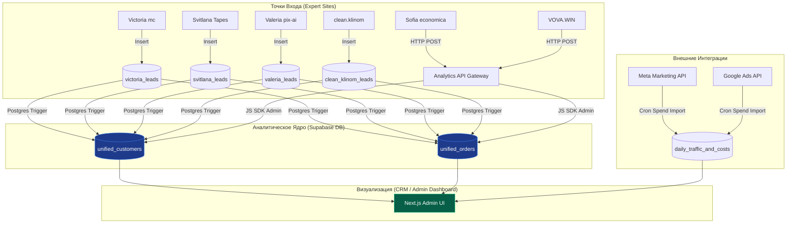

# Документация и Руководство по передаче: Платформа Сквозной Аналитики B&W Analytics

Этот документ содержит исчерпывающее техническое описание архитектуры, схемы данных, API и механизмов сквозной аналитики холдинга **B&W Prod**. Предназначен для разработчиков, проектирующих внутреннюю админ-панель (Dashboard/CRM), а также для подключения будущих экспертных проектов.

---

## 1. Архитектурный обзор системы

**B&W Analytics** — это централизованная платформа сбора конверсий, сквозного когортного анализа и расчета окупаемости рекламы (ROI).

### Технологический стек:
*   **База данных:** Supabase (PostgreSQL) — единый инстанс `B&W Website` (`mfyrftpdhprjyouyjecd`).
*   **API Gateway:** Next.js (App Router, развернут в рамках проекта `victoria-mc`).
*   **Способы интеграции:** Двойной гибридный метод (базовые триггеры СУБД для проектов на общей базе данных + HTTP API Gateway для проектов на изолированных базах).



---

## 2. Реестр проектов и ключи авторизации

В таблице `projects` зафиксированы слаги и API-токены для интеграции внешних проектов:

| Название проекта | Код (Slug) | Идентификатор UUID | API-Ключ для шлюза (Headers) | Способ интеграции |
| :--- | :--- | :--- | :--- | :--- |
| **Victoria** | `victoria` | `b526cfcf-2856-43b9-a299-65239e0f6c27` | `bw_analytics_victoria_key_445566` | ⚡ Триггер СУБД (`victoria_leads`) |
| **Svitlana** | `svitlana` | `c9876e4c-1234-4567-89ab-cdef01234567` | `bw_analytics_svitlana_key_998877` | ⚡ Триггер СУБД (`svitlana_leads`) |
| **Valeria** | `valeria` | `16bcdebf-4375-450a-8bf8-ff7d9b99616e` | `bw_analytics_valeria_key_778899` | ⚡ Триггер СУБД (`valeria_leads`) |
| **clean.klinom**| `clean_klinom` | `a8374d9e-5678-1234-abcd-ef0123456789` | `bw_analytics_clean_klinom_key_665544` | ⚡ Триггер СУБД (`clean_klinom_leads`) |
| **B&W Main** | `bw_main` | `5f4d3c2b-1a2b-3c4d-5e6f-7a8b9c0d1e2f` | `bw_analytics_main_key_000000` | ⚡ Триггер СУБД (`leads`) |
| **Sofia** | `sofia` | `d4bf0cb1-b851-460d-85fa-80df4fcf85c7` | `bw_analytics_sofia_key_112233` | 🌐 HTTP API Gateway |
| **VOVA.WIN** | `vova_win` | `321faecb-7890-4321-bcda-fe0123456789` | `bw_analytics_vova_win_key_332211` | 🌐 HTTP API Gateway |

---

## 3. Схема Базы Данных (Supabase / Postgres DDL)

Схема разделяет понятия «Клиент» и «Заказ» для отслеживания LTV, когортного анализа и исключения декартова произведения в финансовых отчетах.

```sql
-- 1. Справочник проектов
CREATE TABLE projects (
    id UUID PRIMARY KEY DEFAULT gen_random_uuid(),
    name VARCHAR(255) NOT NULL,
    slug VARCHAR(100) UNIQUE NOT NULL,
    api_key_hash TEXT UNIQUE,
    created_at TIMESTAMPTZ DEFAULT NOW() NOT NULL
);

-- 2. Уникальные клиенты (Профили)
CREATE TABLE unified_customers (
    id UUID PRIMARY KEY DEFAULT gen_random_uuid(),
    project_id UUID REFERENCES projects(id) ON DELETE CASCADE NOT NULL,
    name VARCHAR(255),
    phone VARCHAR(50),
    email VARCHAR(255),
    telegram VARCHAR(100),
    created_at TIMESTAMPTZ DEFAULT NOW() NOT NULL,
    updated_at TIMESTAMPTZ DEFAULT NOW() NOT NULL
);

-- Частичные уникальные индексы дедупликации строго внутри одного проекта
CREATE UNIQUE INDEX unique_customer_phone_per_project 
ON unified_customers (project_id, phone) 
WHERE phone IS NOT NULL AND phone != '';

CREATE UNIQUE INDEX unique_customer_email_per_project 
ON unified_customers (project_id, email) 
WHERE email IS NOT NULL AND email != '';

CREATE UNIQUE INDEX unique_customer_telegram_per_project 
ON unified_customers (project_id, LOWER(telegram)) 
WHERE telegram IS NOT NULL AND telegram != '';


-- 3. Транзакции, лиды, оплаты и конверсии (Каждое событие — новая строка)
CREATE TABLE unified_orders (
    id UUID PRIMARY KEY DEFAULT gen_random_uuid(),
    customer_id UUID REFERENCES unified_customers(id) ON DELETE CASCADE NOT NULL,
    project_id UUID REFERENCES projects(id) ON DELETE CASCADE NOT NULL,
    
    amount NUMERIC(10, 2) DEFAULT 0.00 NOT NULL, -- Сумма конкретной транзакции
    status VARCHAR(100) DEFAULT 'new' NOT NULL, -- 'new', 'callback', 'closed_won' (оплата)
    order_id VARCHAR(255), -- ID WayForPay или платежной системы
    
    -- Маркетинговые метрики (с рекламными ID систем)
    utm_source VARCHAR(100),
    utm_medium VARCHAR(100),
    utm_campaign VARCHAR(255),
    utm_content VARCHAR(255),
    utm_term VARCHAR(255),
    
    campaign_id VARCHAR(100), -- Meta/Google Campaign ID
    adset_id VARCHAR(100),    -- Meta Adset ID
    ad_id VARCHAR(100),       -- Meta/Google Ad ID
    
    -- Идентификаторы кликов
    fbclid VARCHAR(255),
    gclid VARCHAR(255),
    fbp VARCHAR(100),
    fbc VARCHAR(100),
    ip_address VARCHAR(45),
    user_agent TEXT,
    
    -- Страница конверсии
    page_path TEXT,
    page_url TEXT,
    visitor_uuid UUID,
    
    metadata JSONB DEFAULT '{}'::jsonb NOT NULL,
    created_at TIMESTAMPTZ DEFAULT NOW() NOT NULL
);

-- 4. Маркетинговые расходы (Импорт из кабинетов)
CREATE TABLE daily_traffic_and_costs (
    id UUID PRIMARY KEY DEFAULT gen_random_uuid(),
    project_id UUID REFERENCES projects(id) ON DELETE CASCADE NOT NULL,
    date DATE NOT NULL,
    
    utm_source VARCHAR(100) NOT NULL,
    campaign_id VARCHAR(100) NOT NULL,
    campaign_name VARCHAR(255),
    adset_id VARCHAR(100),
    ad_id VARCHAR(100),
    
    clicks INTEGER DEFAULT 0 NOT NULL,
    impressions INTEGER DEFAULT 0 NOT NULL,
    spend NUMERIC(10, 2) DEFAULT 0.00 NOT NULL, -- В USD/EUR
    created_at TIMESTAMPTZ DEFAULT NOW() NOT NULL
);

-- Индекс уникальности расходов для предотвращения дублей импорта (с COALESCE для ad_id)
CREATE UNIQUE INDEX unique_daily_spend 
ON daily_traffic_and_costs (project_id, date, utm_source, campaign_id, COALESCE(ad_id, ''));
```

---

## 4. Спецификация API Gateway (Внешняя интеграция)

Универсальный эндпоинт для отправки лидов с сайтов/конструкторов или других CRM.

*   **URL:** `https://victoria-mc.vercel.app/api/v1/leads/register`
*   **Метод:** `POST`
*   **Headers:** `Content-Type: application/json`

### Формат Request Payload (JSON):
```json
{
  "project_slug": "sofia",
  "api_key": "bw_analytics_sofia_key_112233",
  "lead": {
    "name": "Иван Тестовый",
    "phone": "+380991234567",
    "email": "ivan@test.com",
    "telegram": "ivan_tg",
    "amount": 250.00,
    "status": "closed_won",
    "order_id": "WFP_1779360282"
  },
  "marketing": {
    "utm_source": "meta",
    "utm_medium": "cpc",
    "utm_campaign": "vsl_conversion_funnel",
    "campaign_id": "120205837262",
    "ad_id": "120205837265",
    "fbclid": "IwAR0a1b2c3d...",
    "page_path": "/free-lection",
    "page_url": "https://economica.education/free-lection",
    "visitor_uuid": "e64fdebf-2b3b-4b89-8374-b12907729d74"
  },
  "metadata": {
    "tariff": "PRO",
    "quiz_experience": "investor",
    "device_info": "Mobile Safari"
  }
}
```

### Формат Response (JSON):
```json
{
  "success": true,
  "message": "Lead registered successfully.",
  "customer_id": "d135ea24-9bbf-4c74-a633-87a3891ca0f4",
  "order_id": "8b23f2b6-59c4-4bd7-814c-ccab3a129d33"
}
```

---

## 5. Запросы для админки (SQL-рецепты сквозной аналитики)

Разработчик CRM/Админки должен использовать **только эти SQL-запросы** во избежание умножения метрик из-за M:N JOIN-ов.

### Запрос 1: Общая сводная таблица по всем проектам
Рассчитывает расходы, количество заявок, CPL, выручку, чистую прибыль и ROI по каждому эксперту холдинга за выбранный период:

```sql
WITH project_leads AS (
    SELECT 
        project_id,
        COUNT(id) AS total_orders,
        SUM(amount) AS total_revenue
    FROM unified_orders
    WHERE created_at BETWEEN :start_date AND :end_date
    GROUP BY project_id
),
project_costs AS (
    SELECT 
        project_id,
        SUM(spend) AS total_spend
    FROM daily_traffic_and_costs
    WHERE date BETWEEN :start_date AND :end_date
    GROUP BY project_id
)
SELECT 
    p.name AS "Проект",
    p.slug AS "Слаг",
    COALESCE(c.total_spend, 0) AS "Затраты на рекламу ($)",
    COALESCE(l.total_orders, 0) AS "Всего заявок/оплат",
    CASE 
        WHEN COALESCE(l.total_orders, 0) > 0 THEN ROUND(COALESCE(c.total_spend, 0) / l.total_orders, 2)
        ELSE 0 
    END AS "CPL (Стоимость заявки)",
    COALESCE(l.total_revenue, 0) AS "Выручка ($)",
    COALESCE(l.total_revenue, 0) - COALESCE(c.total_spend, 0) AS "Чистая прибыль ($)",
    CASE 
        WHEN COALESCE(c.total_spend, 0) > 0 THEN ROUND((l.total_revenue / c.total_spend) * 100, 2)
        ELSE 0 
    END AS "ROI (%)"
FROM projects p
LEFT JOIN project_leads l ON l.project_id = p.id
LEFT JOIN project_costs c ON c.project_id = p.id
ORDER BY "Выручка ($)" DESC;
```

### Запрос 2: Анализ эффективности рекламных кампаний холдинга
Сводит рекламные затраты по кампаниям (`campaign_id`) с полученной с них выручкой:

```sql
WITH campaign_revenue AS (
    SELECT 
        project_id,
        campaign_id,
        utm_campaign,
        SUM(amount) AS total_revenue,
        COUNT(id) AS total_sales
    FROM unified_orders
    WHERE campaign_id IS NOT NULL
    GROUP BY project_id, campaign_id, utm_campaign
),
campaign_spend AS (
    SELECT 
        project_id,
        campaign_id,
        campaign_name,
        SUM(spend) AS total_spend,
        SUM(clicks) AS total_clicks
    FROM daily_traffic_and_costs
    GROUP BY project_id, campaign_id, campaign_name
)
SELECT 
    p.name AS "Проект",
    COALESCE(s.campaign_name, r.utm_campaign) AS "Кампания",
    s.campaign_id AS "ID Кампании",
    COALESCE(s.total_spend, 0) AS "Расход ($)",
    COALESCE(s.total_clicks, 0) AS "Клики",
    COALESCE(r.total_sales, 0) AS "Продажи",
    COALESCE(r.total_revenue, 0) AS "Выручка ($)",
    COALESCE(r.total_revenue, 0) - COALESCE(s.total_spend, 0) AS "Чистая прибыль ($)",
    CASE 
        WHEN COALESCE(s.total_spend, 0) > 0 THEN ROUND((r.total_revenue / s.total_spend) * 100, 2)
        ELSE 0 
    END AS "ROI (%)"
FROM projects p
LEFT JOIN campaign_spend s ON s.project_id = p.id
LEFT JOIN campaign_revenue r ON r.campaign_id = s.campaign_id AND r.project_id = p.id
WHERE s.campaign_id IS NOT NULL OR r.campaign_id IS NOT NULL
ORDER BY "Чистая прибыль ($)" DESC;
```

---

## 6. Чек-лист подключения нового экспертного проекта (для разработчика)

Когда в холдинг B&W Prod заходит новый эксперт, разработчик должен выполнить следующие шаги:

1.  **Зарегистрировать проект в БД:**
    Добавить запись в `projects`, указав `name`, `slug` и сгенерировав уникальный `api_key_hash`.
2.  **Определить способ интеграции:**
    *   *Вариант А (Общая база):* Создать локальную таблицу лидов в Supabase (например, `newexpert_leads`). Написать для нее триггер по образцу `trg_sync_victoria_lead` с вызовом функции `sync_lead_to_unified()`.
    *   *Вариант Б (Своя база/другой движок):* Интегрировать отправку на стороне веб-приложения через HTTP POST на API Gateway (`/api/v1/leads/register`) с использованием сгенерированного `api_key`.
3.  **Маркетинговые ссылки:**
    Обязать таргетологов настраивать UTM-шаблоны рекламы с динамическими макросами:
    `utm_campaign={{campaign.name}}&utm_id={{campaign.id}}&utm_content={{ad.id}}`
4.  **Meta Ads Cron:**
    Добавить ID нового проекта в Cron-скрипт импорта расходов Vercel для автоматической ежесуточной выгрузки затрат Meta Ads API в `daily_traffic_and_costs`.
