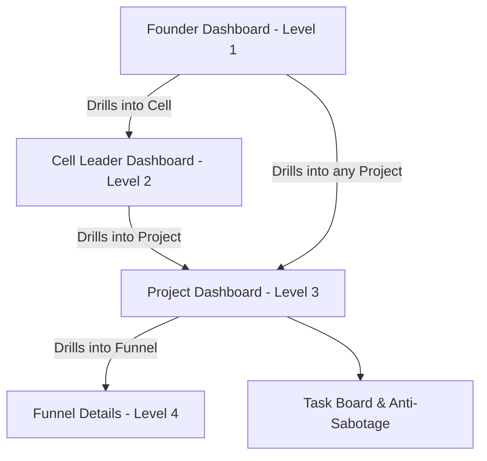

# Feature Specification: CRM v3.1 Modernization (Hierarchy, Roles, Funnels & Ledger)

**Feature Folder**: `specs/005-crm-v3-modernization`

**Created**: 2026-07-15

**Status**: Planning (Detailed Drill-down & Funnels Specification Updated)

---

## 📅 High-Level Architecture Overview

The CRM is being upgraded from a flat workspace to a hierarchical structure. Each role has a targeted entry dashboard, supporting smooth drill-down capability into sub-nodes while keeping strict data security bounds.



---

## 👤 User Scenarios & Routing Rules

### 1. Founder Dashboard (Level 1)
* **Access Control**: Users with roles `founder`, `superman`, or `admin`.
* **Layout**: Displays unified global performance: total revenue, ad spends, ROI, and a leaderboard comparing Cell Leaders and Producers.
* **Drill-down**:
  - Clicking on a **Cell Leader** redirects to `/admin/cell/[cellId]`.
  - Clicking on a **Project** redirects to `/admin/project/[projectId]`.

### 2. Cell Leader Dashboard (Level 2)
* **Access Control**: Users with role `cell_leader`.
* **Restriction**: Allowed to see only their assigned Cell's data. If accessing another `cellId`, return a 403 or redirect to their default cell.
* **Layout**: Aggregated KPI summary for their department (revenue, expenses, Net Profit). Renders performance tables comparing only their assigned Producers.
* **Drill-down**:
  - Clicking on a **Project** redirects to `/admin/project/[projectId]`.

### 3. Project Dashboard & Producer Workspace (Level 3)
* **Access Control**: `founder`, `cell_leader`, `producer`, `sales`, `rop`, `expert`, `marketer`.
* **Access Rules**:
  - Cell leaders can only access projects inside their cell.
  - Producers and Sales agents can only access projects linked to them in `profile_projects`.
  - **Special Case (Bypass Select)**: If a producer is assigned to exactly **one project**, the page bypasses any project selector or list menu, routing them directly to `/admin/project/[projectId]` with that project's view.
* **Tabs**:
  - **Analytics**: Traffic, UTM metrics, performance charts.
  - **Leads Kanban**: Deal progression.
  - **Leads Database**: Full contact history timeline.
  - **Quizzes**: Form/Quiz responses.
  - **Payment Links**: WayForPay link generator.
  - **Funnels**: Funnel manager list & creation panel.
  - **Finance (Expert View)**: Net Profit split calculation (Expert vs Center share). Highly simplified, guest-friendly read-only panel.

### 4. Funnel Deep Dive Dashboard (Level 4)
* **Access Control**: `founder`, `cell_leader`, `producer`, `marketer`.
* **Path**: `/admin/project/[projectId]/funnel/[funnelId]`.
* **Layout**: Filters traffic and orders data strictly by the funnel's linked campaigns and landing pages. Displays stage conversion rates, cost-per-lead, and specific campaign ROIs.

---

## ⚙️ Functional Requirements & Database DDL

### 🛡️ Phase 1 (v2.0) Core Migrations

#### 1. Cells Table
```sql
CREATE TABLE IF NOT EXISTS public.cells (
    id UUID PRIMARY KEY DEFAULT gen_random_uuid(),
    name VARCHAR(255) NOT NULL,
    cell_leader_id UUID REFERENCES public.profiles(id) ON DELETE SET NULL,
    created_at TIMESTAMP WITH TIME ZONE DEFAULT timezone('utc'::text, now()) NOT NULL
);
```

#### 2. Project Modifications (Cell ID & Financial Settings)
```sql
ALTER TABLE public.projects 
ADD COLUMN IF NOT EXISTS cell_id UUID REFERENCES public.cells(id) ON DELETE SET NULL,
ADD COLUMN IF NOT EXISTS default_currency VARCHAR(3) DEFAULT 'UAH' CHECK (default_currency IN ('UAH', 'USD', 'EUR')),
ADD COLUMN IF NOT EXISTS revenue_model VARCHAR(20) DEFAULT '50_50' CHECK (revenue_model IN ('50_50', '70_30', 'FIX')),
ADD COLUMN IF NOT EXISTS expert_share_percent NUMERIC(5,2) DEFAULT 50.00,
ADD COLUMN IF NOT EXISTS fixed_fee_amount NUMERIC(12,2) DEFAULT 0.00;
```

#### 3. Funnels Table
```sql
CREATE TABLE IF NOT EXISTS public.funnels (
    id UUID PRIMARY KEY DEFAULT gen_random_uuid(),
    project_id UUID NOT NULL REFERENCES public.projects(id) ON DELETE CASCADE,
    name VARCHAR(255) NOT NULL,
    start_date DATE NOT NULL,
    campaign_ids VARCHAR(255)[] DEFAULT '{}'::VARCHAR(255)[], -- Matched UTM campaigns
    landing_slugs VARCHAR(255)[] DEFAULT '{}'::VARCHAR(255)[], -- Matched landing page slugs
    description TEXT,
    created_at TIMESTAMP WITH TIME ZONE DEFAULT timezone('utc'::text, now()) NOT NULL
);
```

#### 4. Tasks Table & Funnel Mapping
```sql
CREATE TABLE IF NOT EXISTS public.tasks (
    id UUID PRIMARY KEY DEFAULT gen_random_uuid(),
    project_id UUID NOT NULL REFERENCES public.projects(id) ON DELETE CASCADE,
    funnel_id UUID REFERENCES public.funnels(id) ON DELETE CASCADE, -- Task associated to specific funnel
    title VARCHAR(255) NOT NULL,
    description TEXT,
    due_date DATE NOT NULL,
    status VARCHAR(20) DEFAULT 'TODO' CHECK (status IN ('TODO', 'IN_PROGRESS', 'DONE')),
    created_at TIMESTAMP WITH TIME ZONE DEFAULT timezone('utc'::text, now()) NOT NULL
);

CREATE TABLE IF NOT EXISTS public.task_logs (
    id UUID PRIMARY KEY DEFAULT gen_random_uuid(),
    task_id UUID NOT NULL REFERENCES public.tasks(id) ON DELETE CASCADE,
    changed_by UUID NOT NULL REFERENCES public.profiles(id),
    old_due_date DATE NOT NULL,
    new_due_date DATE NOT NULL,
    postponement_reason TEXT NOT NULL, -- Min 10 chars
    created_at TIMESTAMP WITH TIME ZONE DEFAULT timezone('utc'::text, now()) NOT NULL
);
```

---

## 📈 Success Criteria & Performance Optimizations

1. **Performance (NFR)**:
   - Next.js server-side data fetching directly in layout boundaries.
   - Project dashboard routes use segment-level caching (`revalidate = 0` for fresh updates, but separate server action functions minimize layout shifts).
2. **User Experience**:
   - Single project view directly shown to producers with only one assigned project.
   - Funnel dashboard aggregates UTM-based visitor conversion flows.
